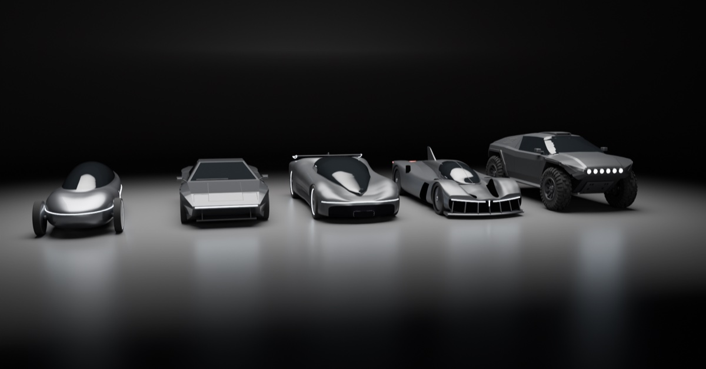
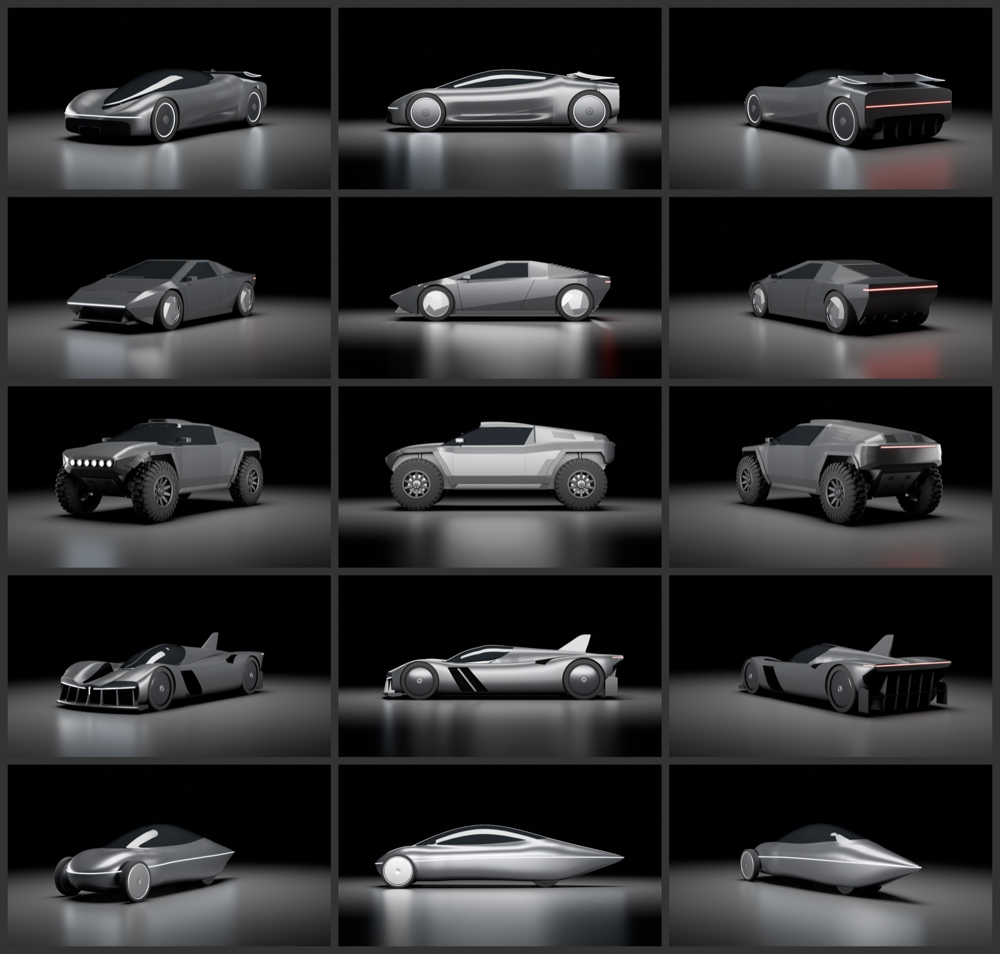

# Collect Cars

Five concept cars. They were designed with GPT Image 2.5 and built as 3D models in Blender with Claude, with no image-to-3D tools involved.

**[→ Open the 3D viewer](https://drcollect.github.io/collect-cars/)**: spin them around in your browser, switch cars, and download the models.

| Car | Size (L × W × H) | Triangles | Download |
|---|---|---|---|
| Hypercar | 4.70 × 2.05 × 1.26 m | 196,500 | [GLB (Draco, 0.3 MB)](models/hypercar.glb) · [GLB (3.8 MB)](models/full/hypercar.glb) |
| 80s Wedge | 4.40 × 1.93 × 1.21 m | 71,240 | [GLB (Draco, 0.2 MB)](models/wedge.glb) · [GLB (1.8 MB)](models/full/wedge.glb) |
| Rally-Raid | 4.60 × 2.10 × 1.79 m | 127,812 | [GLB (Draco, 0.8 MB)](models/rally.glb) · [GLB (4.5 MB)](models/full/rally.glb) |
| Endurance | 4.90 × 1.97 × 1.32 m | 247,752 | [GLB (Draco, 0.4 MB)](models/endurance.glb) · [GLB (5.0 MB)](models/full/endurance.glb) |
| Streamliner | 5.20 × 1.63 × 1.29 m | 389,520 | [GLB (Draco, 0.4 MB)](models/streamliner.glb) · [GLB (9.0 MB)](models/full/streamliner.glb) |

## Colourways and random drops

In the viewer you can repaint any car. Pick a paint (Dropper's indigo, violet and coral are in the palette, next to classic car colours, and there's a free colour picker), a colour for the light strips, and a finish (gloss, satin or matte). The tail lights stay red.

**Random drop** (or the R key) mints a colourway the way [Dropper](https://dropper.page) names its shares: 128 bits from the browser's secure random generator, written as 32 hex characters after the car's name. The bytes pick the paint, with its own slight shade so no two drops are alike, plus the lights and the finish. The drop code goes into the link, for example `#hypercar-312f085719f8cbdceebcae3b2eabb5ed`, so the same drop looks identical for everyone who opens it. **Copy link** shares it.

## How they were made

1. **Concept art.** GPT Image 2.5 produced a design sheet for each car from a text prompt, with several variants per car. Here is the prompt that started it all:
   > Design a futuristic two-seat electric hypercar: the hero car for a collectible video-game drop. Low wedge shape, very low to the ground, a dark tinted glass canopy pushed far forward, big clean smooth side panels, one thin glowing light bar across the front and one across the back, a slim floating rear wing, and large wheels with covered aero discs. Satin graphite grey paint. Show it as one clean design sheet on a plain white background …

   One variant was picked per car. The hypercar is a mix: variant 2's body with variant 5's glowing wheel rings, combined in a single image edit.
2. **Blueprints.** `gpt-image-2.5-sunburst` turned each pick into an orthographic blueprint at one scale, with side, front, top and rear views.
3. **Measurement.** A script read the silhouettes straight out of the blueprint pixels: the roofline, the glass, the wheels and the plan shape.
4. **Blender.** Claude wrote Python scripts that loft each body from those measurements and add the canopy, wheels, light strips, wing, fins, vents and louvres. Each model is checked by drawing its silhouette in red over the blueprint. Four of the cars were built at the same time by parallel Claude subagents.
5. **Export.** The cars were exported as GLB, and Draco compression makes them 5–25 times smaller for the web.

## Using the models

The models are glTF 2.0 binaries (`.glb`), in metres and Y-up, with the nose pointing along +Z. Each car sits centred on the origin with its wheels on the ground. Parts are separate nodes (body, glass, wheels, lights), and the light strips use emissive materials.

- `models/*.glb` are Draco-compressed, which is what the viewer loads. Open them with a Draco decoder, for example three.js `DRACOLoader`.
- `models/full/*.glb` are the same models uncompressed, and open anywhere, including Blender.

## The viewer

`index.html` and `src/` hold a single static page built with [three.js](https://threejs.org): a dark studio with a softbox and strip-light reflections, a mirror floor, and bloom on the light strips. Open a car directly with its link, for example `#wedge`. To run it locally, serve the folder with any static server, such as `python3 -m http.server`.

## License

The models and images are licensed under [CC BY 4.0](https://creativecommons.org/licenses/by/4.0/): use them for anything, with credit. The viewer code is MIT. three.js is MIT, © three.js authors.
